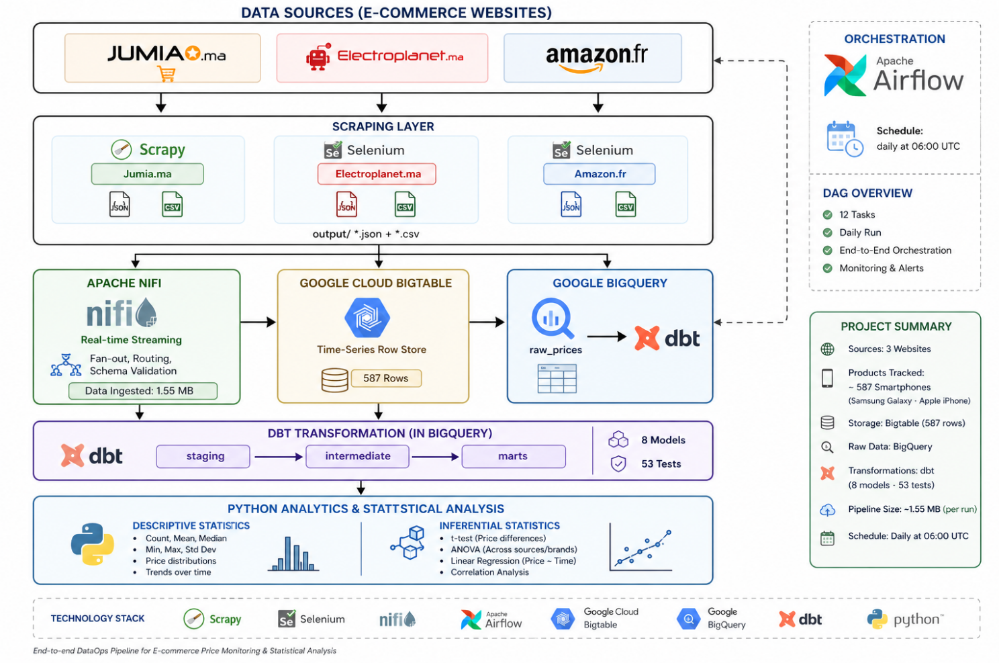
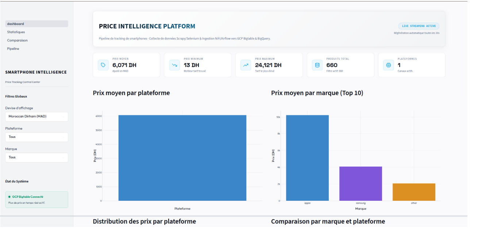
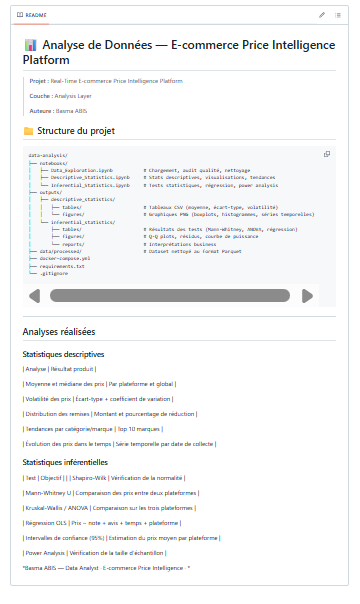
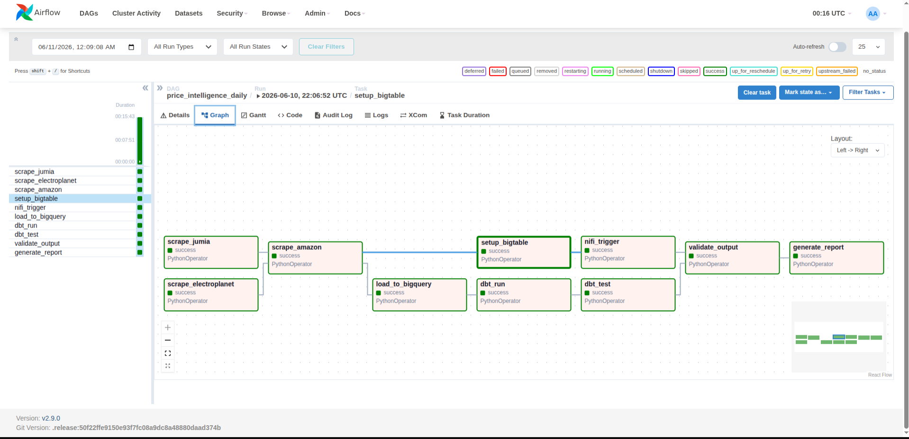
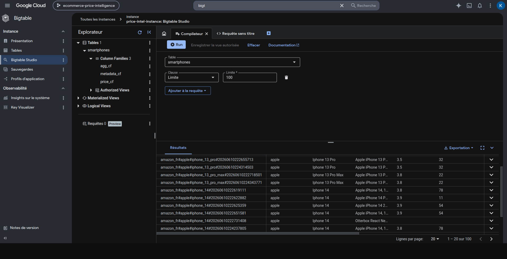

# E-commerce Price Intelligence Platform

Portfolio showcasing my contribution to an end-to-end E-commerce Price Intelligence Platform.

## Project Overview

This project is a collaborative Data Engineering and Analytics platform designed for real-time smartphone price monitoring and market intelligence.

## My Contributions

- Data Analysis
- Data Cleaning and Preprocessing
- Exploratory Data Analysis (EDA)
- Statistical Analysis
- Dashboard Development
- GitHub Collaboration

## Technologies Used

- Python
- Pandas
- SQL
- Jupyter Notebook
- Apache Airflow
- Apache NiFi
- Google BigQuery
- Google Cloud Bigtable
- dbt

## Architecture

## Dashboard

## Data Analysis

## Airflow Orchestration

## Bigtable Storage

## Team Project

This project was developed collaboratively as a team project. This repository highlights my contributions and participation in the platform development process.
